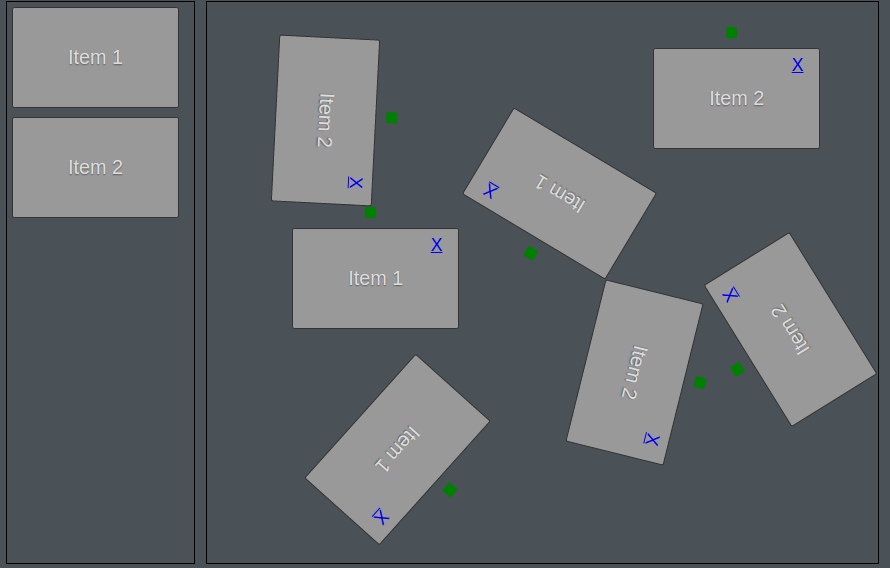

# Jquery Drag and Drop



## About
Using Jquery, Html, CSS and Javascript, implement the D & D(drag and drop), clone, resize, rotate and remove.
This Jquery Drag and Drop example is written by [Big Silver].

## Quick Start

For begin, clone this project and run the following commands in your terminal:

```ssh
$ git clone https://github.com/Big-Silver/Drag-and-Drop.git drag_drop
$ cd drag_drop 
$ Run index.html in browser.
```

```bash
In drag_drop.js

$(document).ready(function(){
	$(".mozgat").draggable({
	  helper: "clone",
	  appendTo: "body",
	  revert: "invalid",
	  snap: ".tapad",
	  stack: ".mozgat",
	  scroll: false
	});
	$("#ch_dndBoard1").droppable({
		cursor: "move",
	  accept: ".mozgat",
	  activeClass: "snaptarget-hover",
	  drop: function (event, ui) {
	    var ct = $(this);
	    var item = $(ui.draggable);
	    var origPos;
	    var ctPos = ct.offset();

	    if (item.is('.tapad')) {
	      origPos = item.offset();
	      ct.append(item);
	    } else {
	      origPos = ui.offset;
	      item = item.clone();
	      ct.append(item);
	      item.removeClass("ui-draggable");
	      item.addClass('tapad');
	      item.draggable({
	        containment: "#dndBoard",
	        snap: ".tapad",
	        stack: ".mozgat",
	        scroll: false
	      });
	item.on('dragend',function(){
	alert(item.getPosition().x+"/"+item.getPosition().y);
	});
	item.resizable();
	item.addClass('remove');
	var ex = $('<a href="Javascript:void(0)" class="delete" title="Remove">X</a>').css({
	'position': 'absolute',
	'bottom': 110,
	'right': 15,
	'height': 10,
	'width': 10,
	'background-color': 'transparent'
	});
	$(ex).insertAfter($(item.find('p')));
	item.appendTo('#droppable');
	$('.delete').on('click', function () {
    $(this).parent('span').remove();
  });
	var ro = $('<div class="rotator"></div>').addClass('handler').css({
	'position': 'absolute',
	'bottom': 100,
	'right': 75,
	'height': 10,
	'width': 10,
	'background-color': 'green'
	});
	$(ro).insertAfter($(item.find('p')));
  item.appendTo('#droppable');
	applyRotation();
	    }
	    item.css({
	      top: origPos.top - ctPos.top - 1,
	      left: origPos.left - ctPos.left -1
	    });
	  }
	});
  $('#snaptarget3').droppable({
    over: function(event, ui) {
        ui.draggable.remove();
    }
  });  
});
function applyRotation() {
  $('.handler').draggable({
    opacity: 0.01,
    helper: 'clone',
    drag: function (event, ui) {
      var rotateCSS = 'rotate(' + ui.position.left + 'deg)';

      $(this).parent().css({
        '-moz-transform': rotateCSS,
        '-webkit-transform': rotateCSS
      });
    }
  });
}

```